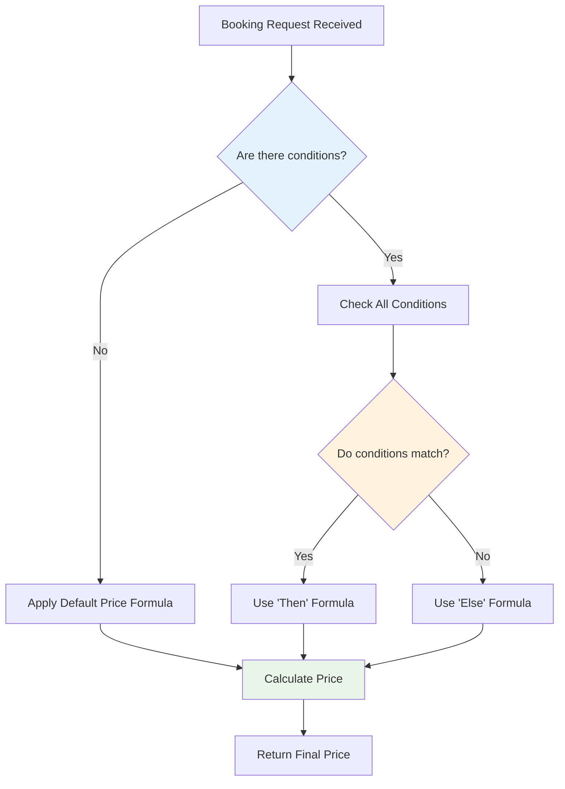
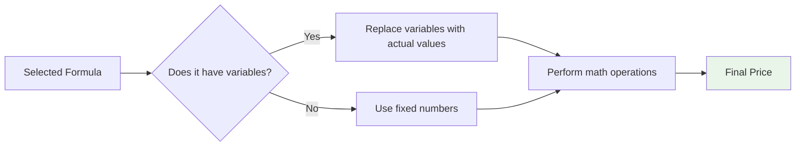
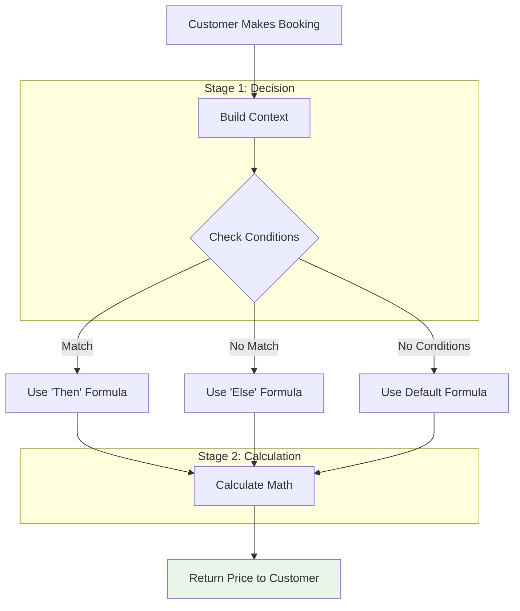
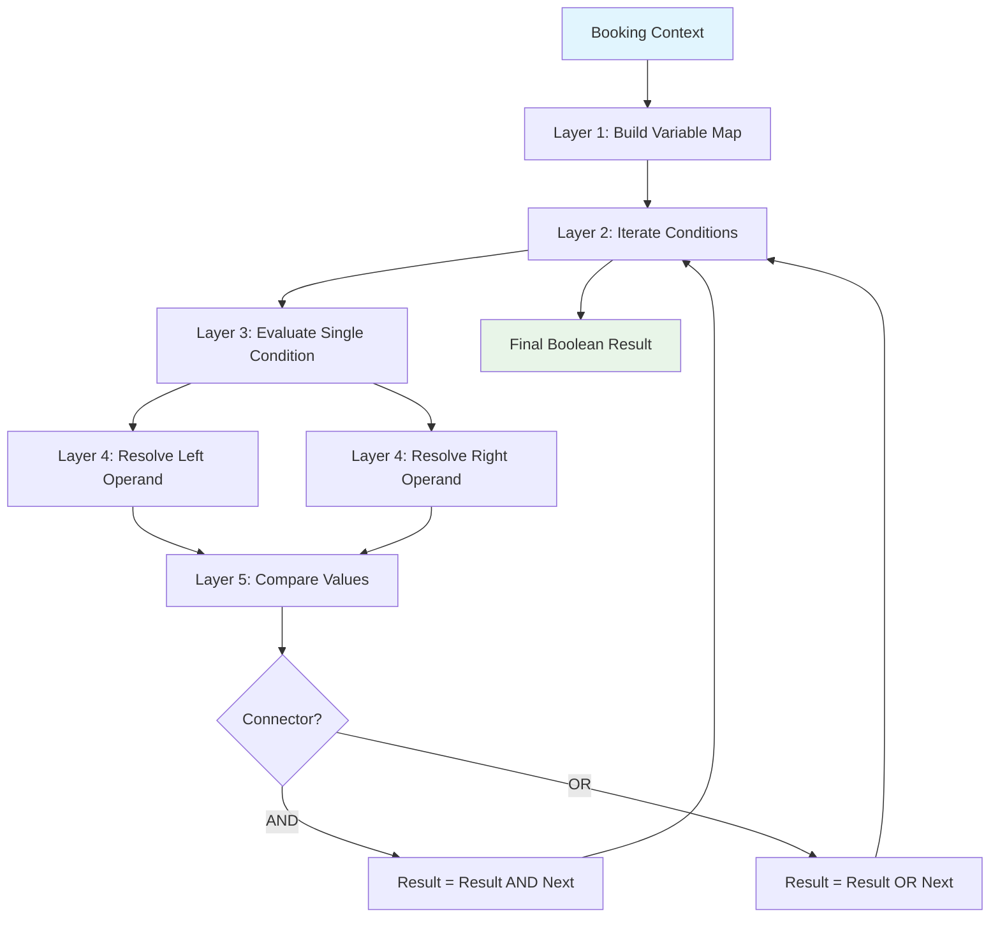

# Pricing Rule Evaluator - Business Guide

## Overview

The Pricing Rule Evaluator is the **brain behind dynamic pricing** in UpSpace. It's a decision-making system that calculates the final price for a booking based on a set of rules and conditions.

Think of it as a **smart calculator** that can:
- Apply different prices based on "if-then-else" logic
- Handle complex math formulas
- Consider time, date, and booking duration

## How It Works: The Two-Stage Process

The evaluator operates in two distinct stages:

### Stage 1: Decision Logic (The "If" Check)

This stage determines **which pricing rule applies** to the booking.



**Key Concept**: Conditions are like questions the system asks:
- "Is this a weekend booking?"
- "Is the duration longer than 4 hours?"
- "Is the guest count more than 10 people?"

### Stage 2: Calculation Logic (The Math)

Once the correct formula is selected, the system performs the actual calculation.



**Key Concept**: Variables are placeholders that get filled with real data:
- `booking_hours` → 4 hours
- `day_of_week` → Saturday (represented as number)
- `guest_count` → 15 people

## The Complete Flow

Here's how a booking flows through the entire system:



## Inputs & Variables

The system uses these key inputs to make decisions:

### Booking Context
| Variable | Description | Example |
|----------|-------------|---------|
| `booking_hours` | Total duration in hours | 4.5 hours |
| `booking_days` | Total duration in days | 1.5 days |
| `booking_weeks` | Total duration in weeks | 2 weeks |
| `booking_months` | Total duration in months | 1 month |

### Time & Date Context
| Variable | Description | Example |
|----------|-------------|---------|
| `day_of_week` | Day of the week (0-6, Monday=0) | Saturday = 5 |
| `date` | Current date | 2024-01-15 |
| `time` | Current time | 14:30 (2:30 PM) |

### Booking Details
| Variable | Description | Example |
|----------|-------------|---------|
| `guest_count` | Number of guests | 5 people |
| `area_max_capacity` | Maximum capacity of the area | 20 people |
| `area_min_capacity` | Minimum capacity requirement | 1 person |

## Real-World Examples

### Example 1: Weekend Surcharge

**Business Rule**: Add 20% surcharge for weekend bookings.

**Configuration**:
- **Conditions**: Check if `day_of_week` is Saturday (5) or Sunday (6)
- **Formula**: 
  - `Then`: `base_price * 1.20` (apply 20% surcharge)
  - `Else`: `base_price` (regular price)

**Scenario**:
- Saturday booking, 4 hours duration
- System checks: "Is it weekend?" → Yes
- System calculates: `base_price * 1.20`
- Result: Customer pays 20% more than weekday rate

### Example 2: Long-Stay Discount

**Business Rule**: Offer 15% discount for bookings longer than 8 hours.

**Configuration**:
- **Conditions**: Check if `booking_hours` > 8
- **Formula**:
  - `Then`: `hourly_rate * booking_hours * 0.85` (15% discount)
  - `Else`: `hourly_rate * booking_hours` (regular rate)

**Scenario**:
- 10-hour booking on a weekday
- System checks: "Is duration > 8 hours?" → Yes
- System calculates: `hourly_rate * 10 * 0.85`
- Result: Customer receives 15% discount

### Example 3: Peak Hour Pricing

**Business Rule**: Higher rates during peak hours (9 AM - 5 PM).

**Configuration**:
- **Conditions**: Check if `time` is between 09:00 and 17:00
- **Formula**:
  - `Then`: `base_rate * 1.25` (peak pricing)
  - `Else`: `base_rate` (off-peak pricing)

**Scenario**:
- Booking at 2:00 PM (peak hour)
- System checks: "Is time between 9 AM and 5 PM?" → Yes
- System calculates: `base_rate * 1.25`
- Result: Customer pays peak hour rate

### Example 4: Multi-Condition Rule

**Business Rule**: Weekend + Long Stay = Special Discount

**Conditions**:
1. `day_of_week` is Saturday or Sunday
2. `booking_hours` > 6

**Formula**:
- `Then`: `hourly_rate * booking_hours * 0.70` (30% discount)
- `Else`: Standard pricing

**Scenario**:
- Saturday booking for 8 hours
- System checks both conditions: "Weekend?" Yes + "Long stay?" Yes
- System applies special discount: 30% off
- Result: Customer gets premium discount for weekend long-stay

## How Rules Are Stored

Each pricing rule consists of:

1. **Name & Description**: Human-readable identifier
2. **Variables**: Inputs the rule can use (booking hours, date, etc.)
3. **Conditions**: The "if" logic (what triggers the rule)
4. **Formula**: The "then/else" math (how to calculate the price)

## Benefits for Business

- **Flexibility**: Create complex pricing strategies without code changes
- **Transparency**: Clear logic that can be reviewed and adjusted
- **Consistency**: Same rules apply across all bookings
- **Scalability**: Easy to add new pricing strategies as business grows

## Common Use Cases

- Seasonal pricing (summer/winter rates)
- Volume discounts (bulk bookings)
- Time-based pricing (morning/evening rates)
- Capacity-based pricing (group size adjustments)
- Special event pricing (holiday surcharges)

## How Conditions Are Checked (Technical Detail)

The condition checking works as a **5-layer pipeline**, where each layer has a specific responsibility:

```
Layer 1: Variable Map      → Collects all variable values into a lookup table
Layer 2: Condition Sequence → Iterates through conditions with AND/OR logic
Layer 3: Single Condition   → Evaluates one condition (left vs right)
Layer 4: Operand Resolution → Resolves what each side of the comparison is
Layer 5: Value Comparison   → Performs the actual comparison (>, <, =, etc.)
```

### Layer 1: Variable Map Construction

Before any conditions are evaluated, the system creates a dictionary of every variable's resolved value.

Values come from three sources:

- **Booking context**: `booking_hours`, `booking_days`, `booking_weeks`, `booking_months` are computed from the raw booking duration
- **Time context**: `date`, `time`, `day_of_week` are derived from the current timestamp
- **Custom variables**: Resolved from explicit overrides or the variable's default value

For example, `day_of_week` converts JavaScript's Sunday=0 convention to Monday=0 using the formula `(day + 6) % 7`.

### Layer 2: Condition Sequence (AND/OR Logic)

Conditions are processed **left-to-right, sequentially**:

1. The first condition is evaluated — this becomes the running result
2. For each subsequent condition:
   - The condition is evaluated independently
   - Its `connector` property is read (`and` or `or`, defaults to `and`)
   - The result is combined:
     - `and`: both must be true
     - `or`: at least one must be true
3. The final boolean is returned

**Important**: All conditions are evaluated regardless of intermediate results. There is no short-circuit optimization.

### Layer 3: Single Condition Evaluation

Each condition is evaluated by:

1. Resolving the `left` operand to a concrete value
2. Resolving the `right` operand to a concrete value
3. Comparing the two values using the specified comparator (`<`, `<=`, `>`, `>=`, `=`, `!=`)
4. If the condition is marked as `negated`, the result is inverted

### Layer 4: Operand Resolution

Each side of a comparison can be either a **variable** or a **literal**:

**Variable operands**: The system looks up the variable by key in the pre-built variable map. If the variable doesn't exist or has no value, an error is thrown.

**Literal operands**: The system first checks if the literal's text matches a declared variable key (a shortcut reference). If not, it parses the literal based on its type:

| Type       | Parsed As                          | Example              |
|------------|------------------------------------|----------------------|
| `number`   | Numeric value                      | `10` → 10            |
| `text`     | String value                       | `"vip"` → "vip"      |
| `date`     | UTC timestamp (start of day)       | `2024-01-15` → timestamp |
| `datetime` | Full timestamp                     | `2024-01-15T14:30:00Z` → timestamp |
| `time`     | Seconds since midnight             | `14:30` → 52200      |

### Layer 5: Value Comparison

The final comparison depends on the types of both operands:

- **Both numeric**: Standard numeric comparison (e.g., `10 > 5` → true)
- **Either text**: String comparison using lexicographic/Unicode ordering (e.g., `"apple" < "banana"` → true)
- **Unsupported comparator**: Returns false as a safety fallback

Dates and times are normalized to numbers before reaching this layer, so they use numeric comparison.

### Visual: The Full Condition Pipeline


